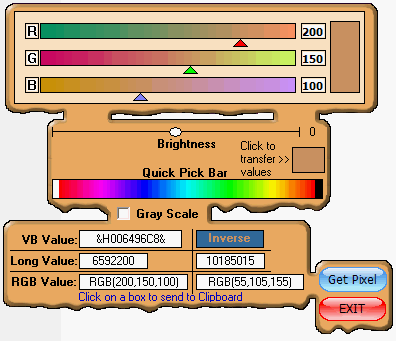



## ColorPicker again \(Updated 3\-1\-2010\)

### Description

The original author of this code is Jim Benvenuti. It is a beautiful control, but too bulky for my needs. I've reduced it to its basics. Hope you like it and find it helpful.

Update: Got rid of the class module(took some doing on my part). It is now a freestanding control.

update: added a working demo of control.
 
### More Info
 

             |
---                |---
**Submitted On**   |2010-03-01 08:05:56
**By**             |[Kenneth Foster](https://github.com/Planet-Source-Code/PSCIndex/blob/master/ByAuthor/kenneth-foster.md)
**Level**          |Intermediate
**User Rating**    |5.0 (30 globes from 6 users)
**Compatibility**  |VB 6\.0
**Category**       |[Custom Controls/ Forms/  Menus](https://github.com/Planet-Source-Code/PSCIndex/blob/master/ByCategory/custom-controls-forms-menus__1-4.md)
**World**          |[Visual Basic](https://github.com/Planet-Source-Code/PSCIndex/blob/master/ByWorld/visual-basic.md)
**Archive File**   |[ColorPicke217608312010\.zip](https://github.com/Planet-Source-Code/kenneth-foster-colorpicker-again-updated-3-1-2010__1-72925/archive/master.zip)

